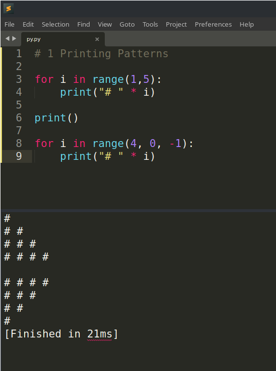

# aeroMIT_TP

# Section A

---

#### 1 What are the types of motors available for multi-rotors? Explain in detail which one is the most efficient and why with an extensive comparison with the rest.

The two types of motors available for multi-rotors are:

- Brushed

  It has more components as compared to brushless motors due to the presence of commutators and brushes

- Brushless

Brushless motors are more efficient for the following reasons:

- Absence of brushes
  Except for the shaft support, the stator and rotor in a brushless motor are virtually separate entities. This reduces mechanical energy loss due to friction, thus giving longer life
- Better speed control
  Since brushless motors have three input wires as compared to just one in brushed motors (excluding ground), they offer more precise control. For example, sudden motor speed changes can be performed while performing abrupt manoeuvres.
- Outrunner motors (rotor rotating outside over the stator)
  It isn't easy to have an efficient DC outrunner motor because of the brushes, which would need to be somehow mounted on the outer periphery of the motor casing. This would make the design too bulky and prone to damage. Source: https://drones.stackexchange.com/questions/844/are-there-any-brushed-outrunner-motors

---

#### 2 How is the working of a tricopter different from that of a quadcopter? Imagine you are building a UAV for a competition; which one would you prefer? Give a detailed explanation.

A tricopter has three arms, whereas a quadcopter has four. All four quadcopter arms have one motor each; two spin clockwise, and the other two spin counterclockwise. Even the tricopter has one motor per arm, but one of the motors is made moveable on the axis of the arm by connecting it to a servo motor. This is used for the yaw movement, which otherwise would not be possible, like in a quadcopter, wherein the yaw movement can be done by changing the speed of the motors.

For a competition where payload carrying capacity is important, we would prefer a quadcopter over a tricopter as it has more thrust and can be used to carry cameras, medicine etc. But if the competition is racing-oriented or asks for longer flight time, we might go for a tricopter as it is more agile and due to the lesser number of motors it can give better battery life.

---

#### 3 Explain in detail the flight movement shown by drones on the three axes. How do they achieve those? How are these movements achieved on a fixed wing plane?

Flight movement shown by drones on the three axes are:

- Roll

  Movement of a drone about the longitudinal axis. The word "longitude" used here is similar to earth's longitude, which means it's vertical. This movement is required to make the drone go left or right. To go left, both the motors on the right of the quadcopter spin faster than those on the left and vice versa.

- Pitch

  Movement of a drone about a lateral axis. This movement is used to make a drone move forward or backwards. To go forward, both the motors on the back of the quadcopter spin faster than those on the front and vice versa.

- Yaw

  Movement of the drone about the Z axis or the vertical axis. This kind of motion is used to change the heading of the drone. For example, a drone might have a camera mounted on it one side of the drone. When airborne, if the camera has to capture something on the left, the drone itself has to move ninety degrees to the left. This is the yaw movement.

  It is achieved by making one set of diagonal propellers run faster than the rest. The other set of propellors can be made to rotate a bit slower, too, as the balance of the quadcopter would still be maintained.

  This causes yaw because, in a quadcopter, the alternate propellors rotate in similar directions to maintain a net angular momentum of zero; if one set of alternate propellors is spinning clockwise, the other will spin counterclockwise. When one set increases speed, the angular momentum shifts in their favour and yaw occurs.

  It is useful to note here that if instead of alternate propellors if two successive propellors spun in the same direction when the yaw moment is done, if that set is increased in speed, there would be a thrust imbalance, and the quadcopter would roll over. Hence the alternate `cw-ccw-cw-ccw` configuration is opted for.

On a fixed-wing plane, these movements are achieved by the use of servo motors which move parts of the plane's fuselage:

- Roll: Aileron

  Behind each wing at the edge, there will be a movable flap. To make the plane roll, the flaps on either wing will rotate in opposite directions. This causes a change in the lift on both wings and causes roll movement.

- Pitch: Elevator

  The back ends of each horizontal tail surface will be movable in the up-down direction. Both the flaps will move upwards to make the plane pitch up, causing a low-pressure region under the flaps and a high-pressure region above it, and vice versa.

- Yaw: Rudder

  The back edge of the vertical tail fin is movable. Moving it to the right would cause the right yaw and vice versa.

---

#### 4 Explain in detail the working of an ESC and the way it controls a BLDC motor.

An Electronic Speed Controller (ESC) has the following parts:

- Output wires for the motor \* 3
- Power input wires \* 2
- Signal cable \* 1
- \+ 5V cable \* 1

When the ESC is initially switched on with a Lithium Polymer (lipo) battery:

- the Battery Eliminator Circuit (BEC) steps down the input voltage to 5 Volts and provides the same on the 5V cable

- it waits for a 50Hz pulse width modulated (PWM) signal on the signal wire from either an R/C receiver or the flight controller

An ESC has three main functions:

- Making the Brushless Direct Current (BLDC) rotor rotate

  A BLDC motor is similar to a 3-phase AC motor. Taking the example of an outrunner motor, it consists of a stator which is divided into three similar arms 120 degrees apart with copper windings on them. The spinning part is the rotor which is present over the stator. The rotor has magnets lined up through its circumference.

  When an input signal is received, the ESC starts by providing a positive voltage, say 5V, on one of the motor inputs while keeping the other two inputs at -5V for a very short time, say 100 ms. This causes the copper coil in the arm connected to that wire to get magnetized and thus attract the rotor.
  After 100 ms, it switches the power to another motor input, making the other two motors -5V. The rotor is now attracted to this other arm of the stator. And after another 100 ms has passed, it repeats the process. This subsequent switching of the voltages in the three motor inputs makes the rotor rotate. The rate of switching determines the speed of the motor, and the signal wire controls this rate.

- Improving motor efficiency

  When the motor rotates, due to Faraday's law, a reverse current is generated in the motor cables, especially the ones that are in the Off state. The ESC "listens" to this feedback given by the motor and accordingly adjusts the current to optimize the motor output.

- BEC

  The Battery Eliminator Circuit (BEC) steps down the input voltage to 5 Volts and provides the same on the 5V cable. Not all ESCs possess BECs.

Apart from these main functions, an ESC also provides functions with some secondary functions dependent on the firmware:

- Quick Braking

  Making the rotor stop suddenly by causing it to suddenly rotate in the opposite direction when the throttle stick is brought to zero. This feature prevents damage to the propellor of a fixed-wing plane while landing because a rotating propellor has both angular and linear momentum. In contrast, a non-rotating propellor has only linear momentum; hence, lesser force acts on it if it hits the ground.

- Safety features

  If the R/C throttle is not at zero when the ESC is powered on, it won't let the motor start unless it's brought to zero first.

---

#### 5 What are the operational frequencies of the electronic components on a quadcopter? Explain why those are chosen specifically and what are their advantages and disadvantages.

As the ESC uses a PWM signal, it operates at 50 Hz. The frequency of the flight controller will depend on the microcontroller chip used.

The radio control for the drone's movement is done at 2.4 Ghz frequency, whereas the video transmission is usually done at 5.8 GHz.

This is because of the following facts:

- Frequency is inversely proportional to wavelength
- Signal range and minimum antenna size are directly proportional to wavelength
- Signal quality is directly proportional to the frequency

The live video feed should be clear enough; hence it's at the 5.8Ghz frequency. Also, since it is far from 2.4 GHz, there will be minimal overlap between the two signals.

Hence 2.4 GHz gives better range but with lesser bandwidth (amount of data), whereas 5.8 GHz can carry more data (higher the frequency, more energy) but has lesser range and is more prone to interferences like mobile towers and electric poles.

---

# Section B

---

#### 1 What is a PID loop and explain in detail how and why is it used in drones?

A Proportional Integral Derivative controller is a critical drone component that provides stabilization and autonomous control. Based on the inputs from sensors like the Inertial Measurement Unit (IMU) and barometer, it tweaks the speed of the motors to obtain the desirable state (a defined setpoint); for example, to hover in place or move as directed by the pilot. The IMU contains the accelerometer, gyroscope and magnetometer.

The PID Loop refers to the loop constructed by providing the feedback given by the motors to the PID controller and the sensors' input. The PID controller continuously calculates an error value e(t) as the difference between the desired setpoint SP and a measured process variable PV (sensor data) and applies a correction based on proportional, integral, and derivative settings set by the pilot. The controller then uses this correction and attempts to minimize the error over time by adjustment of a control variable u(t) which in the case of drones is the speed of the motors.

Various factors related to the drone's movement, such as its responsiveness to commands, time taken to stop to a hover, etc., can be tweaked by setting the P, I and D parameters in the flight controller's settings.

A brief overview of the P, I and D settings:

- P gain determines how hard the flight controller works to correct an error; it represents responsiveness. A high P value makes the drone snappy, whereas a low value would make it sloppy.

- I gain determines how hard the flight controller works to hold the drone's attitude against external forces, such as wind and off-centred CG. It is like the drone's stiffness setting

- D gain dampens the effects of the P gain and reduces the overshoots. Since the derivative term measures the rate of change of error, increasing it can help detect when the P gain is reducing error way too fast and thus soften it. The drone can suffer from bounce-backs if the D value is too low.
  For example, stopping the drone suddenly after moving forward for a while could cause it to pitch backwards. This would be because the P gain would want the drone to stop and hover, and hence it would increase the speed of the forward rotors and vice versa. But due to low D gain, the forward motors might increase in speed too much, causing backward pitch.

---

#### 2 What are the different types of modulation techniques available for use in drones ? Explain these protocols in detail.

The two modulation techniques available for drones are Pulse Width modulation and Pulse Position modulation.

Devices like Servos and Electronic Speed Controllers use PWM as signal input, whereas R/C transmitters, receivers and Flight Controllers are usually capable of handling both PPM and PWM signals.

- Pulse Width Modulation (PWM)

  It is a technique used to relay data through varying pulse width. In PPM, the analogue sample values determine the position of a narrow pulse relative to the clocking time.

  In PWM, each RC channel has its own cable. The reason for having multiple R/C channels in an aircraft is to have more freedom. For example, in a fixed-wing plane, one channel might go to the throttle motor, whereas two others will go to the ailerons, another two to the elevators and another one to the rudder. Hence if we want six channels, we must wire all six cables along with the power and ground. The value of each channel is represented as a 1 millisecond to 2ms "ON" signal, which repeats every 20 ms (50 Hz frequency). The amount of time it is "ON" is the value for that channel.

- Pulse Position Modulation (PPM)

  PPM operates similarly to PWM, with the difference being that all the channels are carried on a single cable. This is accomplished by lining up several PWM signals back to back; each channel is sent successively, followed by a delay. When all the channels have been sent, it loops back to channel one. Normal PWM operates at 50Hz frequency, which means that each update takes 20 milliseconds. So if each channel takes up to 2ms, a maximum of 10 channels can be fit within that 20ms. Hence PPM allows there to be just one cable from the R/C receiver to the Flight Controller for all the control channels.

---

#### 3 Explain the working of UART, I2C and SPI communication protocols. Give a comparison between them in detail.

UART, I2C and SPI are all examples of Serial communication protocols. Serial communication sends data one bit at a time, sequentially, over a communication channel instead of parallel communication, where several bits are sent as a whole on a link with several parallel channels.

- UART (Universal Asynchronous Receiver-Transmitter)

  This protocol uses two wires known as Tx (transmit) and Rx (Receive) for both components to communicate and is one of the most minimalist serial protocols. Since UART is an asynchronous protocol, it doesn't have a clock that regulates data transmission speed. As an alternative, it utilizes the "baud rate" for timing when a bit is to be transmitted. The usual baud rate used for UART is 9600 baud, meaning a transmission rate of 9600 bits per second. At this speed, one bit takes about 100 microseconds to be transmitted.

  To let the receiver know when data is about to be transferred, a "Start Bit" (low signal) and then to let the receiver know that the last bit (most significant bit) has been sent, a "Stop Bit" (high signal) is sent.

  Specs:

  Minimum number of wires: 1

  Duplex: Full Duplex

  Number of masters and slaves: One each

  An example of a device where UART is used is the HC05 Bluetooth module. To change its settings, it's connected to a computer via a UART to USB serial converter. The Tx of the HC05 is connected to the Rx of the converter and vice versa.

- SPI (Serial Peripheral Interface)

  SPI is another serial protocol used for faster data rates of about 20Mbps. It has lower power consumption than other synchronous protocols like I2C.

  It uses a total of four wires, namely SCK (Serial Clock Line), MISO (Master In Slave Out), MOSI (Master Out Slave In), and SS/CS (Slave/Chip Select). Unlike UART, SPI uses a master-to-slave format to control multiple slave devices with only one master. The MISO wire acts like the Tx from the slave in UART, whereas the MOSI is like the Tx from the master to the slave; that is, it transfers data from the master device to the slave device.

  SCK is clock output from the master and is used for synchronization because, unlike UART, SPI is a synchronous protocol. The SS wire is used to select the slave to be controlled out of the multiple slave devices that may be connected.

  Specs:

  Minimum number of wires: 3

  Duplex: Full Duplex

  Number of masters and slaves: Single master, one or more slaves

- I2C (Inter-IC bus)

  I2C is another synchronous serial protocol like SPI, but with several advantages over it. These include having multiple masters and slaves, simple addressing (no need for Chip Select), operating with various voltages, and using only two wires.

  The two pins in an I2C protocol are the SDA (Serial Data Line) which transmits and receives data, and the SCL (Serial Clock Line) pin, which functions as a clock. Since there is a single wire to transmit and receive data, I2C is Half Duplex.

  The working of I2C is more complicated than UART. When the master wishes to read or send data to the slave, it starts with the master sending a start bit (low signal) from its SDA pin, followed by a seven-bit address that selects the slave and one bit for selecting read or write. The slave responds with an ACK (acknowledgement) bit and listens for incoming transmission. Now in case the master wishes to read data, it selects the register of the slave it wishes to access and sends eight bits specifying it. The slave responds by sending the requested data, after which an Acknowledge bit is sent to the master, following which the master ends with a stop bit (high signal).

  Specs:

  Minimum number of wires: 2

  Duplex: Half Duplex

  Number of masters and slaves: Multiple masters and slaves

---

#### 4 What is a telemetry module and why is it used in a drone? Is it possible for a drone to fly without a telemetry module?

A telemetry module uses radio waves to transmit telemetry, that is, the readings of sensors on the drone to a device on the ground, on which they can be displayed or recorded. It usually transmits important information like the battery voltage, the temperature of onboard components, amount of fertilizer/pesticide left in case of agricultural drones etc.

Some telemetry modules can transmit the information and receive commands to pass on to the flight controller. For example, the APM or Pixhawk flight controllers can be given commands from the "Mission Planner" application running on a ground station.

Telemetry can also be provided on the on-screen display (OSD) by overlaying the information over the video if a live video stream is being sent.

A drone can fly without a telemetry module with only the R/C uplink but doing so is risky because the pilot would have no idea about the status of the components on the drone, most importantly, the battery level.

---

#### 5 What types of batteries are used in a drone and why? Give a brief explanation.

Drone batteries must have a high storage capacity for higher flight time and a large power output. Apart from this, they need to be small, lightweight, and not get too hot when used. There are four types of drone batteries:

- Lithium-Polymer

  The Lipo battery is the most common in almost all electric drones. It's compact, lightweight, and has a large energy capacity to operate any drone. Moreover, when in storage, it has a slower discharge rate which means it can hold charge better. This is useful because one can stay long without using them without worrying about them discharging.

- Nickel Cadmium

  These batteries existed before the lipo batteries and can't give very high currents like lipo batteries. They also have a small energy capacity which makes them unable to hold a charge for long, hence shorter life expectancy, and lower energy density.
  They also suffer from the "memory effect." This occurs when the battery is repeatedly charged without being fully discharged, causing it to "remember" its previous charge capacity and gradually lose its ability to hold a charge. This can result in reduced battery life and performance over time. NiCd batteries are also less environmentally friendly than other types of batteries, as they contain toxic materials that can harm the environment if not disposed of properly.

- Lithium High Voltage (LiHv)

  Compared to the 4.2V output of Lipo batteries, LiHv batteries can provide 4.35V. Hence they are used in racing and nano drones because they function well with high voltage.

- Brand-Specific

  Manufacturers like DJI design their own batteries for their drones which come with advanced features like telemetry, safety features etc. Their drones work with only their batteries.

Specs related to lipo battery:

- S rating

  This refers to the number of cells. Each cell can have a maximum voltage of 4.2 Volts and a (suggested) minimum voltage of 3.7 Volts. For example, a 3S battery will be three cells connected in series, giving a max voltage of 12.6 V and a min voltage of 11.1 V. Racing drones generally use 4S upto 6S batteries as they need more power. In contrast, other drones looking for more flight time go for 3S batteries.

- mAh

  Explaining with an example, a 5000mah battery which is 5 Amp-hour, can supply 5 Amps of current for an hour, after which it's completely drained. So if this battery is put on a quadcopter with the motors continuously consuming 50 Amps of power, the drone can run for around 6 minutes.

- C rating

  It's the cell's maximum discharge rate. Say the battery mentioned above has a C rating of 20. This means the maximum current we can pull out of it is 5A \* 20 = 100 Amps.

The disadvantages of the lipo battery are:

- Doesn't function properly in cold weather
- Delicate construction

  Any kind of puncture can lead to an explosion. This can happen if the battery is tightly mounted on the drone and a screw or some other pointed object pierces it.

- Battery swelling

  When a lipo battery is constantly used for long periods, especially when it's overcharged or over discharged, electrolyte decomposition occurs, leading to oxygen gas buildup, which is a fire risk. Since the outer covering of the battery is completely sealed, the gas can't escape, and the battery puffs up.

---

# Section C

---

#### 1 Complete the playlist till video number #34 (Types of arguments in python). There are 2 videos containing questions (1- Printing patterns, 2- Prime numbers). You will have to implement these codes on your own in a compiler/IDE of your own choice. You are needed to add a screenshot of the code and the output in your report. https://youtube.com/playlist?list=PLsyeobzWxl7poL9JTVyndKe62ieoN-MZ3

---

#### 2 It's the time of apocalypse and zombies have taken over your city. It's getting dark and you are lost. You are surrounded by various groups of zombies.There is at least one shortest path that will take you from your current position to your house. Write a program (or deduce an algorithm) using which you can surely find the way out. As for the input grid/ matrix, you have a M×M grid representing the city, filled with Z(representing the zombie group), A (the start point), B (the end point). The empty spaces in the grid can be assumed as the open space which you can use as your path to the destination. You are allowed to move only right / left / downwards in the grid. In case you are not familiar with any programming language, write the pseudocode/ algorithm for the same.

We would start from point A towards point B in a straight line since that would be the shortest way. As we are allowed to move only right, left and downwards, it is understood that B is below the horizontal line of A. If we encounter any Z along the way, we will make two branches at that point, the first branch will move left, and the second branch will move one step right. After this, both branches will try to move downwards; if they cannot do so, they will take one more step in their previous direction and then try to go down. In the same way, the two branches may branch into more branches. This step will be repeated until any one branch reaches B. The path taken by that branch would be the shortest.

---

#### 3 We are participating in a competition where we are told to detect a target and drop a payload. We are given a flight time limitation of 20 minutes. You choose an autonomous mode of navigation. List out the components you feel are required to maneuver the drone according to the given problem statement and also state out each of their specifications to get a flight time of 20 minutes.

We must first find the target within the given perimeter to accomplish the given task. For this, the drone needs to be equipped with a pattern detection or image recognition system, depending on the specifications of the target. This system would consist of a camera (standard or infrared) and an image processing system. This system can be present on the drone itself or the ground, from where it can be controlled.

If chosen to be onboard the drone, the image processing system could consist of a small computer like a Raspberry Pi. And if it's on the ground, we would need a video transmission system consisting of a transmitter on the drone and a receiver on the ground where the video output could be given to a laptop running an image processing program.

The drone needs to cover the complete area within the perimeter. To save time and not re-visit the areas already covered, the drone needs to remember the places it has already covered, for which we would need a GPS sensor. Also, an obstacle avoidance system can be designed using SONAR/LiDAR sensors to avoid obstacles. Once the drone has located the target to drop the payload, a servo motor can be used to drop the payload.

During the flight, if the flight time limitation of 20 minutes is nearing, the drone could speed up by itself at the expense of lower-quality scanning. It could also switch other scanning modes, such as a wide-angle camera or even use the obstacle avoidance system to find and scan objects. Doing so would be faster since object scanning using SONAR would be faster than image recognition as the latter requires a clear video feed which won't be possible if the drone flies too fast.
