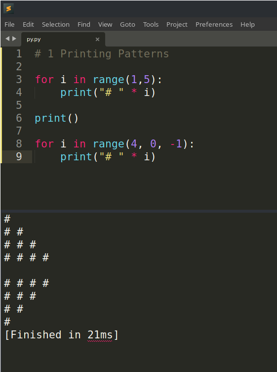
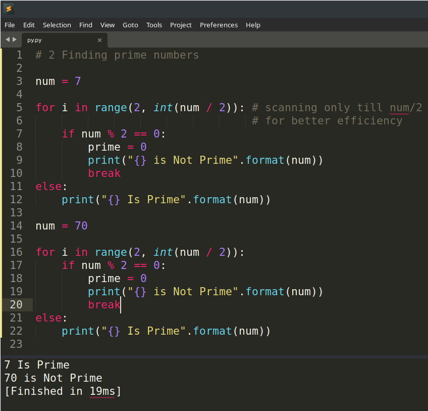

# Section C

---

#### 1 Complete the playlist till video number #34 (Types of arguments in python). There are 2 videos containing questions (1- Printing patterns, 2- Prime numbers). You will have to implement these codes on your own in a compiler/IDE of your own choice. You are needed to add a screenshot of the code and the output in your report. https://youtube.com/playlist?list=PLsyeobzWxl7poL9JTVyndKe62ieoN-MZ3

---

#### 2 It's the time of apocalypse and zombies have taken over your city. It's getting dark and you are lost. You are surrounded by various groups of zombies.There is at least one shortest path that will take you from your current position to your house. Write a program (or deduce an algorithm) using which you can surely find the way out. As for the input grid/ matrix, you have a M×M grid representing the city, filled with Z(representing the zombie group), A (the start point), B (the end point). The empty spaces in the grid can be assumed as the open space which you can use as your path to the destination. You are allowed to move only right / left / downwards in the grid. In case you are not familiar with any programming language, write the pseudocode/ algorithm for the same.

We would start from point A towards point B in a straight line since that would be the shortest way. As we are allowed to move only right, left and downwards, it is understood that B is below the horizontal line of A. If we encounter any Z along the way, we will make two branches at that point, the first branch will move left, and the second branch will move one step right. After this, both branches will try to move downwards; if they cannot do so, they will take one more step in their previous direction and then try to go down. In the same way, the two branches may branch into more branches. This step will be repeated until any one branch reaches B. The path taken by that branch would be the shortest.

---

#### 3 We are participating in a competition where we are told to detect a target and drop a payload. We are given a flight time limitation of 20 minutes. You choose an autonomous mode of navigation. List out the components you feel are required to maneuver the drone according to the given problem statement and also state out each of their specifications to get a flight time of 20 minutes.

We must first find the target within the given perimeter to accomplish the given task. For this, the drone needs to be equipped with a pattern detection or image recognition system, depending on the specifications of the target. This system would consist of a camera (standard or infrared) and an image processing system. This system can be present on the drone itself or the ground, from where it can be controlled.

If chosen to be onboard the drone, the image processing system could consist of a small computer like a Raspberry Pi. And if it's on the ground, we would need a video transmission system consisting of a transmitter on the drone and a receiver on the ground where the video output could be given to a laptop running an image processing program.

The drone needs to cover the complete area within the perimeter. To save time and not re-visit the areas already covered, the drone needs to remember the places it has already covered, for which we would need a GPS sensor. Also, an obstacle avoidance system can be designed using SONAR/LiDAR sensors to avoid obstacles. Once the drone has located the target to drop the payload, a servo motor can be used to drop the payload.

During the flight, if the flight time limitation of 20 minutes is nearing, the drone could speed up by itself at the expense of lower-quality scanning. It could also switch other scanning modes, such as a wide-angle camera or even use the obstacle avoidance system to find and scan objects. Doing so would be faster since object scanning using SONAR would be faster than image recognition as the latter requires a clear video feed which won't be possible if the drone flies too fast.
